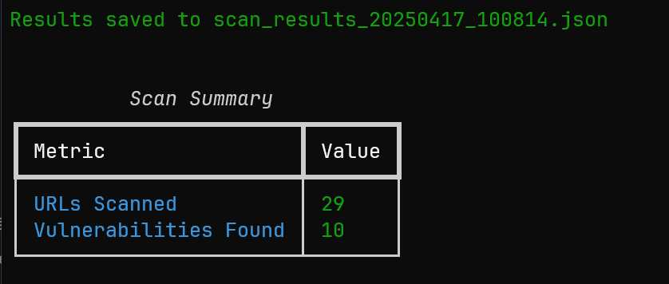

# VulnScan

A powerful and modern web vulnerability scanner built in Python. VulnScan helps security researchers and penetration testers identify common web vulnerabilities through automated scanning and analysis.



## Features

- 🕷️ Recursive web crawling
- 🛡️ Multiple vulnerability checks:
  - Cross-Site Scripting (XSS)
  - SQL Injection
  - Open Redirects
  - Security Headers Analysis
  - Server-Side Request Forgery (SSRF)
  - Directory Traversal
- 📊 Beautiful console output with progress tracking
- 📝 Detailed JSON reports
- 🚀 Multi-threaded scanning
- 🔄 Configurable scan depth
- 📈 Real-time vulnerability reporting

## Installation

1. Clone the repository:
```bash
git clone https://github.com/yourusername/VulnScan.git
cd VulnScan
```

2. Install required packages:
```bash
pip install -r requirements.txt
```

## Usage

Basic usage:
```bash
python main.py https://example.com
```

Advanced options:
```bash
python main.py https://example.com --threads 15 --depth 3 --output scan_results.json
```

### Arguments

- `url`: Target URL to scan
- `--threads`: Number of concurrent threads (default: 10)
- `--depth`: Crawling depth (default: 2)
- `--output`: Custom output file path for JSON results

## Example Output

```
╭──────────── Scan Configuration ────────────╮
│   Web Vulnerability Scanner               │
│   Target: https://example.com            │
│   Depth: 2                               │
│   Threads: 10                            │
╰──────────────────────────────────────────╯

[*] Starting scan...
[*] Found XSS vulnerability in /search?q=
[*] Missing security headers in /admin
[*] Potential SQL injection in /products?id=1

Scan Summary
├── URLs Scanned: 150
└── Vulnerabilities Found: 12
```

## Disclaimer

This tool is for educational and ethical testing purposes only. Always obtain proper authorization before scanning any web applications. The authors are not responsible for any misuse or damage caused by this program.

## Contributing

Contributions are welcome! Please feel free to submit a Pull Request.

## License

This project is licensed under the MIT License - see the [LICENSE](LICENSE) file for details.

## Author

- Jordan (@j0rrdnn)

## Acknowledgments

- Thanks to all contributors and the security research community
- Built with Python and various awesome open-source libraries
